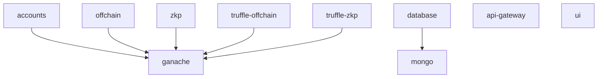
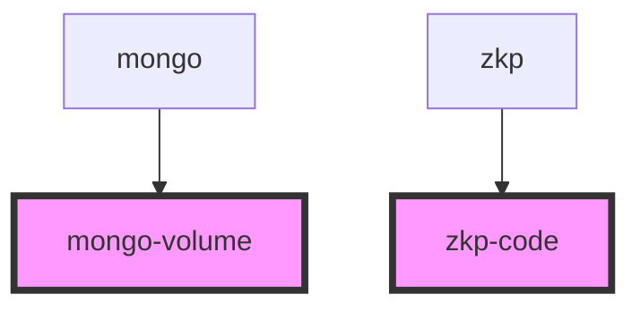
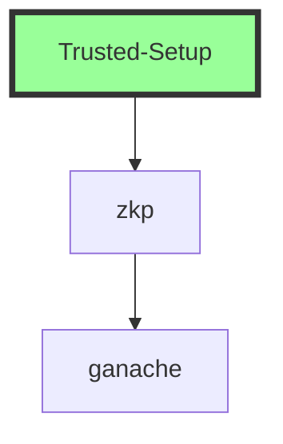

TODO: how to document the Product/config folder? and every other folder listed in docker-compose.yml?

# Nightfall Architecture

This document introduces the components of Nightfall & their interdependencies, and shows which components you will use for different use cases. Notes are also given to prepare you for developing/improving any of these components.

## The components

Each component of Nightfall is packaged as a single Docker container.

TODO: add links on each component below (docker-compose.yml definition, source code, documentation)

* accounts
  * TODO: detail
* api-gateway
  * TODO: detail
* offchain
  * TODO: detail
* zkp
  * TODO: detail
* ui
  * TODO: detail
* ganache
  * TODO: detail
* database
  * TODO: detail
* mongo
  * TODO: detail
* truffle-offchain
  * TODO: detail
* truffle-zkp
  * TODO: detail
* mongo-volume
  * TODO: detail
* zkp-code
  * TODO: detail

## Interdependencies

The components above have dependiencies on each other as documented (depender → dependee) below:

TODO: fix dependencies to show components that depend on each other due to dotdocker



Also, persistant storage is made to disk (Docker volumes) with two different containers.

todo: fix diagram to show any other storage usage



## Use cases

**Perform trusted setup**

:alarm_clock: Depending on your machine, setup can take one to several hours.

Nightfall requires a proving and verifying key to guarantee the validity of all zero-knowledge proof transactions. (Read more about Nightfall zero-knowledge proofs.) TODO: Add link here. This use case generates these keys and saves them to the zkp-code volume, which is saved on disk at `Product/zkp/code/`.

Utilized components: zkp, ganache.



To perform this use case, just run the provided script:

```sh
./Use-Cases/Trused-Setup.sh
```

For additional information on how key generation works, see the [Nightfall key generation guide]() TODO: add link to what was previously README-manual-trusted-setup.md

**Build and run user interface**

Nightfall provides a web user interface for end users to work with tokens using secure… TODO: utilize existing market speak.

Utilized components: zkp, ganache. TODO: update this...

TODO: add diagram

To perform this use case, first be sure you have an existing proving and verifying key saved at TODO location and run the provided script:

```sh
[ -f /tmp/foo.txt ] || exit
[ -f /tmp/foo.txt ] || exit
./Use-Cases/Run-Nightfall-Interface.sh
```

**Perform user interface integration tests**

This validates the user interface for required functionality using wholistic integration tests across the same modules used to build and run the user interface.

These tests are run as part of continuous integration and run against every accepted and potential change to Nightfall.

TODO: add tests

**Perform unit testing**

Unit tests are run in each module to validate required functionality in that module. The tests exist in each module and you would use them when developing the module. But we have also provided a script for you to run all tests in succession.

These tests are run as part of continuous integration and run against every accepted and potential change to Nightfall.

TODO: show how to run this

**Run full demo**

:warning: Running the full demo will overwrite any existing trusted setup you have already created.

⏰ Depending on your machine, setup can take one to several hours.

TODO: do not allow trusted setup to run if existing trusted setup is found. Require it to be deleted first

This use case will run the tested setup on your computer and run the fully functional application which you can access from your web browser.

```sh
./Use-Cases/zkp-demo.sh
```